# Analyse d'une infrastructure existante, identification des failles de sécurité et recommandations

## Réalisé par :
- Chaimae BOUKANZIA
- Chantal GUILLAUME
- Christ MOUGANI
- Christopher ALFRED
- Dorian CORMERAIS
- Fares MENTSEUR
- Fatima BERRABAH
- Garmi GROBOST
- Jaouad SALAHY
- Mbaye GUEYE
- Patrice ELIE DIT COSAQUE
- Rijandrisolo RANDRIANARIVONY

## Contexte:
Il nous a été demandé d’analyser les vulnérabilités d’une application Web Spring Boot fournie. Les outils dont nous disposions pour analyser cette application étant sur la vm kali linux, nous avons choisi d’installer l’application sur cette vm linux.

### Commande nmap –script vuln
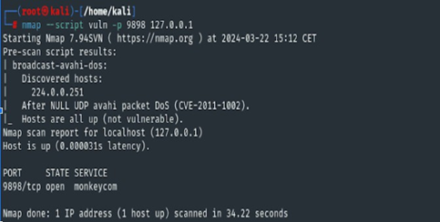

#### Pré-analyse des scripts :
Le script broadcast-avahi-dos a été exécuté pour détecter une vulnérabilité potentielle de déni de service (DoS) liée à Avahi.

Ce script vise à détecter la vulnérabilité CVE-2011-1002 qui est une vulnérabilité de type déni de service dans Avahi. Le script envoie des paquets Avahi NULL UDP pour déterminer si un hôte répond de manière anormale à ces paquets ce qui pourrait indiquer la présence de la vulnérabilité. Le script n'a pas détecté de vulnérabilité sur votre machine locale.

La sortie indique que l'hôte n'est pas vulnérable à cette attaque (Hosts are all up).

#### Rapport de scan :
L'hôte localhost (127.0.0.1) est en ligne et répond rapidement.
Le port 9898 est ouvert sur cet hôte et un service nommé "monkeycom" est en cours d'exécution sur ce port.

En résumé, le scan confirme simplement que le port 9898 est ouvert sur l'hôte localhost (127.0.0.1) et qu'un service nommé "monkeycom" écoute sur ce port. Aucune vulnérabilité spécifique n'a été détectée sur ce port lors de ce scan.

Après recherche, “monkeycom” s’avère être un ver sasser informatique qui a affecté les systèmes Windows en 2004. Pour vérifier, on a effectué un test pour voir s’il est actif sur notre machine virtuelle linux.

### Commande netstat -tuln
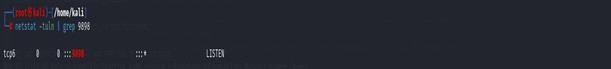

La sortie de la commande netstat montre qu'un processus écoute sur le port 9898 en TCP version 6 (:::9898). Cela signifie que le port 9898 est utilisé en mode écoute (LISTEN) sur le système en IPv6.

### Commande lsof -i
Pour déterminer quel processus utilise ce port, nous avons utilisé la commande suivante pour obtenir l'ID du processus (PID) :

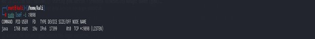

La commande lsof montre que le processus avec le PID 1768, appartenant à l'utilisateur root, utilise le port 9898 en mode écoute (LISTEN). Le nom du processus est "java".

Cela indique qu'une application Java est en cours d'exécution et écoute sur le port 9898. On peut examiner davantage ce processus pour déterminer s'il s'agit d'une application légitime ou non.
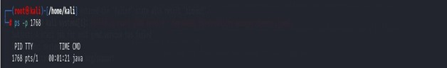

monkeycom étant un virus windows, il aurait fallu faire les manipulations sous environnement windows pour qu’il soit identifié comme virus.

### Test shellshock:
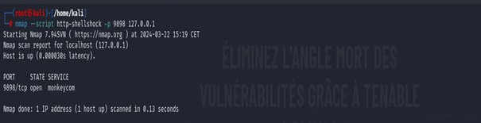

Le service exécuté sur le port 9898 ne semble pas être vulnérable à l'exploitation de la faille Shellshock. Plus précisément, la vulnérabilité Shellshock réside dans la façon dont Bash interprète les fonctions définies par l'utilisateur stockées dans les variables d'environnement. En exploitant cette vulnérabilité, un attaquant peut envoyer des données malveillantes contenant des commandes Bash spécialement conçues dans les en-têtes HTTP, les paramètres CGI, les variables SSH, etc. Lorsque Bash traite ces données, il exécute les commandes indésirables, permettant ainsi à l'attaquant de prendre le contrôle du système.

### Commande nmap –script ftp-anon
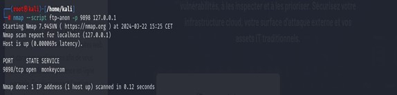

Selon les tests effectués par le script Nmap ftp-anon, le service exécuté sur le port 9898 ne semble pas être configuré pour permettre l'accès FTP anonyme. Il est toujours important de vérifier et de configurer correctement les services pour minimiser les risques de sécurité.

### Commande nmap –script rpcinfo
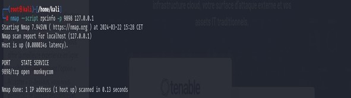

La commande ci-dessus montre qu’aucun service RPC n'est en cours d'exécution sur cet hôte au moment du scan. Les services RPC sont souvent utilisés dans les environnements informatiques distribués, où les composants logiciels doivent communiquer entre eux sur des réseaux locaux ou étendus. Ils facilitent le développement de logiciels distribués en masquant la complexité de la communication réseau et en fournissant une abstraction qui permet aux développeurs de penser aux appels de procédures de manière similaire à des appels de fonctions locales.

### Commande nmap –script smb-vuln*
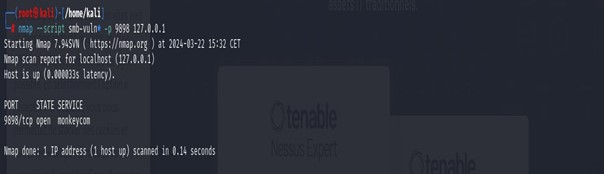

Le résultat du scan indique que le port 9898 est ouvert sur l'hôte localhost (127.0.0.1), mais aucun service SMB (Server Message Block) n'est détecté sur ce port lors du scan. Cela signifie qu'aucune vulnérabilité connue des services SMB n'a été détectée sur le port 9898 de cet hôte. Il est toujours important de garder les systèmes à jour avec les derniers correctifs de sécurité et de suivre les meilleures pratiques en matière de sécurité pour réduire les risques de compromission du système.

### Commande curl
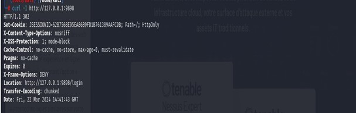
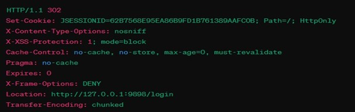

Dans ces en-têtes, plusieurs éléments de sécurité sont présents :
- Set-Cookie: Ceci définit un cookie de session avec l'attribut HttpOnly, ce qui signifie que le cookie ne peut pas être accédé via JavaScript, ce qui peut aider à atténuer les attaques XSS (Cross-Site Scripting).
- X-Content-Type-Options, X-XSS-Protection, X-Frame-Options: Ces en-têtes fournissent des directives de sécurité pour le navigateur, telles que l'activation de l'option "nosniff" pour empêcher le navigateur de deviner le type MIME du contenu, l'activation de la protection XSS et le paramètre de la politique de trame pour empêcher le chargement du site dans un cadre.
- Cache-Control, Pragma, Expires: Ces en-têtes contrôlent le cache côté client et indiquent au navigateur de ne pas mettre en cache la réponse.
- Location: Cette en-tête indique au navigateur de rediriger vers l'URL spécifiée.

Ces en-têtes peuvent aider à renforcer la sécurité de l'application web en réduisant les risques d'attaques telles que les attaques XSS, le détournement de session et le détournement de clics.

### Commande sqlmap

La sortie de SQLMap indique que les paramètres username, password et id ne semblent pas être injectables. Cela signifie que SQLMap n'a pas réussi à trouver de vulnérabilités d'injection SQL dans ces paramètres.
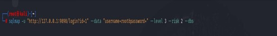

- --level 3 spécifie le niveau de test d'injection SQL. Un niveau 3 signifie que SQLMap effectuera des tests d'injection SQL avancés.
- --risk 2 spécifie le risque d'exécution d'une attaque SQL. Un risque de 2 indique que SQLMap effectuera des tests d'injection SQL risqués.
- --dbs indique à SQLMap de détecter les bases de données disponibles sur la cible.
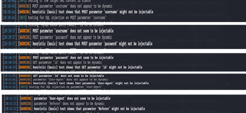

La sortie de SQLMap indique que tous les paramètres testés ne semblent pas être injectables. Voici quelques actions qui pourraient être faites pour améliorer les tests. On n’a pas pu augmenter le level et le risk car cela fait planter la machine virtuelle.

### Test de brute force avec Legion
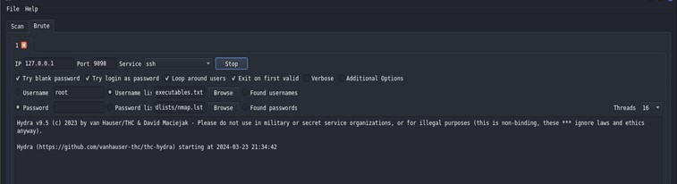

Le premier test que fait Legion est le blank password. Il est recommandé de toujours mettre un mot de passe.

## Conclusion
La conclusion de cette analyse de vulnérabilité révèle une infrastructure globalement robuste. L'analyse par divers outils a permis d'identifier et de tester plusieurs aspects critiques de la sécurité informatique, notamment la prévention des dénis de service, l'exposition des ports et services, l’exposition aux virus et malwares, la vulnérabilité aux injections SQL.

L'utilisation de l'outil Nmap a révélé qu'aucune vulnérabilité spécifique n'a été détectée concernant le port 9898, malgré la présence du service "monkeycom".

Toutefois, il est bon de souligner l'importance du contextes d'exploitation vis-à-vis de la menace, dans notre cas un ver Windows dans un environnement Linux.

De plus, le test Shellshock et l'analyse des services SMB n'ont pas montré de vulnérabilités, ce qui est rassurant. Par ailleurs, les en-têtes de sécurité identifiés via la commande curl démontrent une bonne configuration pour contrer certaines attaques web courantes comme le XSS.

Cependant, l'absence de vulnérabilités ne doit pas mener à un excès de confiance. Le test SQLMap n'a pas révélé d'injections SQL. Néanmoins, la limitation liée à la capacité de la machine virtuelle à gérer des tests plus avancés rappelle l'importance d'infrastructures adéquates pour le pentesting.

Enfin, le test de brute force avec Legion souligne une pratique essentielle en sécurité : l'utilisation de mots de passe forts pour éviter les accès non autorisés.

En conclusion, cette analyse met en lumière la sécurité relativement élevée de l'application et de son infrastructure. Il est cependant essentiel de rester vigilant face aux nouvelles vulnérabilités et en adoptant une approche proactive pour les tests de sécurité, la mise à jour régulière des outils et systèmes et l'évaluation continue des risques.

